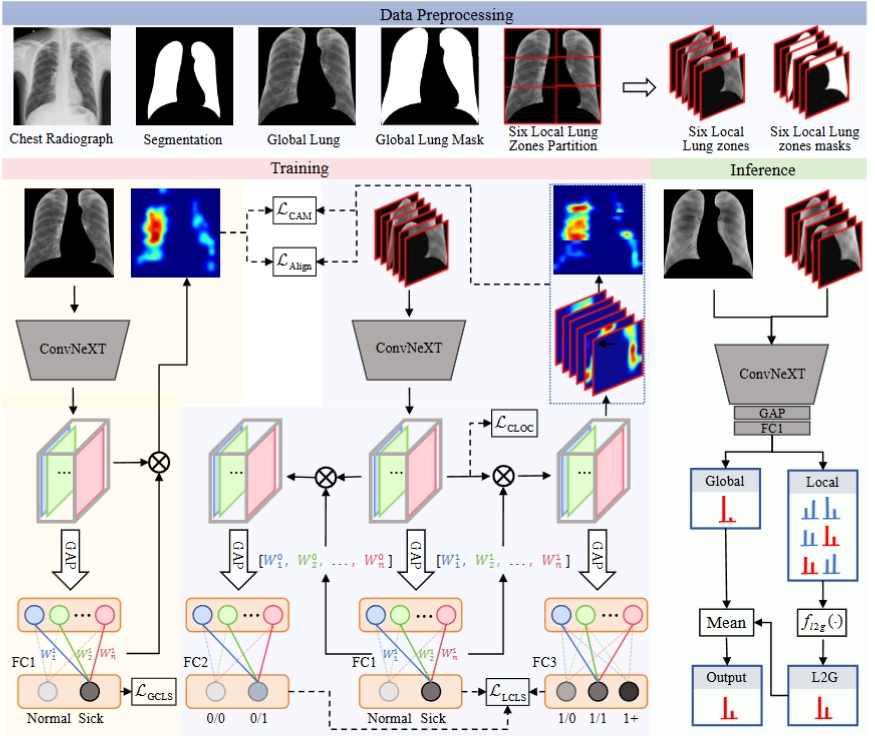

<div align="center">
<h1>SLGMS </h1>
<h3>A Clinically Aligned Local-Global Mutual Learning Framework for Interpretable Pneumoconiosis Diagnosis</h3>

Jiarui Wang, Xuerong Wang, Le Yang, Binglu Wang, Xiaoxu Wang


</div>


## Overview

<p align="center">
  
</p>

## Main Results

## Getting Started
### Preparation
* Install required packages:
```bash
conda create -n CALGM python=3.9 -y
conda activate CALGM 
conda install pytorch==1.13.0 torchvision==0.14.0 torchaudio==0.13.0 pytorch-cuda=11.6 -c pytorch -c nvidia
pip install packaging
pip install timm==0.4.12
pip install pytest chardet yacs termcolor
pip install submitit tensorboardX
pip install triton==2.0.0
pip install fvcore
pip install pandas
pip install fairscale
pip install matplotlib
pip install scikit-learn
pip install numpy==1.26.4
```

* Download [Convnext_pretrained_pt](https://download.openmmlab.com/mmclassification/v0/convnext-v2/convnext-v2-tiny_fcmae-in21k-pre_3rdparty_in1k_20230104-8cc8b8f2.pth).
* Preprocess the original chest radiographs by ChexMask ([paper](https://www.nature.com/articles/s41597-024-03358-1), [code](https://github.com/ngaggion/CheXmask-Database))
<p align="center">
  
</p>
*Tip.*
   - As for the Rectangular Lung Region achievement, we provide the [data_preprocessing_by_chexmask.py](data_preprocessing_by_chexmask.py). Though replace it with ['CheXmask-Database/HybridGNet/inferenceWithHybridGNet.py'](https://github.com/ngaggion/CheXmask-Database), you can get the same data preprocessing like our paper.
   
* Train
``
python train_pneumoconiosis/train.py
python train_jsrt/train.py
``
   - We provide the trained model weight [here](https://drive.google.com/drive/folders/1HVfHbIsMKDCXissKg9gpwYMDVuoZz0JQ?usp=sharing).

* Test
``
python train_pneumoconiosis/eval.py
python train_pneumoconiosis/eval.py
``

